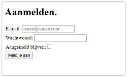
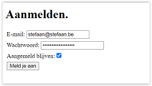
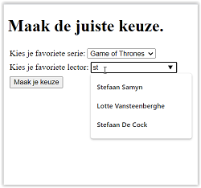
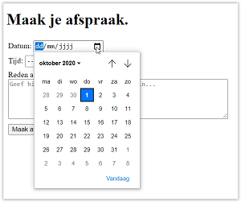
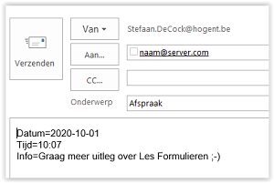

# Oefeningen les 5: Formulieren

In deze oefeningen maken we een aantal formulieren aan.     
Je stuurt steeds je formulier naar je mail client (outlook, ...). Hiervoor geef je volgende waarde aan het action-attribuut in je form tag: "mailto:*je hogent e-mailadres*".           
Zorg ervoor dat als je op de tekst (label) van een formulier element klikt, je focus krijgt in het overeenkomende formulier element.             
Binnen elk formulier plaats je elk label- en formulierelement samen tussen **div** elementen. Er ligt in elk bestand een link naar *css/main.css*. Deze zorgt ervoor dat er witruimte gecreëerd wordt tussen de form elementen.         
Schrijf correcte html, test deze op https://validator.w3.org/nu/, om onderstaande screenshots in je browser weer te geven.

-----

## Oefening 1: Aanmeldingsformulier.

Open bestand oefening01.html. Maak onderstaand aanmeldingsformulier.       
       
   
E-mail en wachtwoord zijn verplichte velden. Bij e-mail voorzie je een voorbeeld in de input (zie figuur hierboven).   
Het formulier wordt verstuurd met de POST method naar *je hogent e-mailadres* met als onderwerp **Aanmelden**       

-----

## Oefening 2: Keuzelijsten.

Open bestand oefening02.html. Maak onderstaand formulier met twee keuzelijsten.    
De eerste is een selectlist (één keuze) en de tweede maakt gebruik van een datalist.

          

       
Bij de tweede lijst krijg je onderstaand resultaat als je **st** in het input veld typt.     
      
Het formulier wordt verstuurd met de POST method naar *je hogent e-mailadres* met als onderwerp **Keuzes**  

        

-----

## Oefening 3: Maak je afspraak.

Open bestand oefening03.html. Maak onderstaand formulier met datum en tijd veld en een tekst veld met meerdere lijnen (5 rijen en 60 karakters per rij).   
Alle velden zijn verplicht en het tekstveld heeft een voorbeeldtekst.    

          

      
Het formulier wordt verstuurd met de POST method naar *je hogent e-mailadres* met als onderwerp **Afspraak**                       
 

        

-----
## Oefening 4: Registreer.

Open bestand oefening04.html. Maak onderstaand formulier.   
Naam, voornaam, e-mail en privacybeleid zijn verplicht in te vullen.
Abonneren op nieuwsbrief staat reeds aangevinkt.          
Er zijn twee knoppen: één om te verzenden en één om het formulier naar zijn oorspronkelijke vorm te brengen.

            
Het formulier wordt verstuurd met de POST method naar *je hogent e-mailadres* met als onderwerp **Registreer**                       
 

        

-----
## Oefening 5: Poll.

Open bestand oefening05.html. Maak onderstaand formulier.   
Je moet bij beide keuzegroepen verplicht één keuze invullen. Meerdere keuzes aanduiden kan niet.    
Er zijn twee knoppen: één om te verzenden en één om het formulier naar zijn oorspronkelijke vorm te brengen.

            
Het formulier wordt verstuurd met de POST method naar *je hogent e-mailadres* met als onderwerp **Poll**                       
 

        

-----
## Oefening 6: Favorietjes - Score.

Open bestand oefening06.html. Maak onderstaand formulier.      
       
Kies je favoriete kleur. Zorg ervoor dat rood (#ff0000) als kleur staat ingesteld.      
Kies je favoriete getal. Zorg ervoor dat 13 als default staat ingesteld. Je mag geen negatieve waarde kunnen ingeven. Dit is een verplicht veld.     
      
Geef met een slider een score (tussen 0 en 20) aan dit vak. Default waarde is 15.       
Om de score naast de slider weer te geven voorzie je een **span** tag met **id="showScore"**. Geef aan de slider (input tag) een **id="score"**.      
          

Het formulier wordt verstuurd met de POST method naar *je hogent e-mailadres* met als onderwerp **Poll**                       
         

        

-----